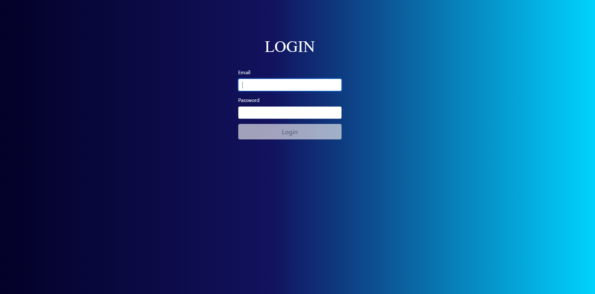
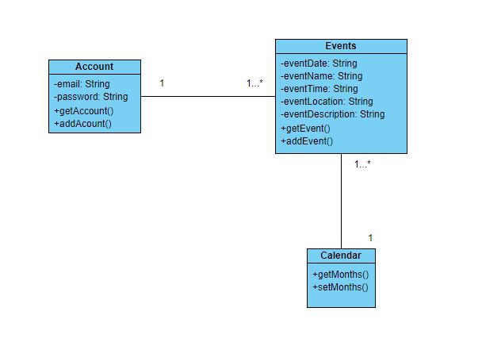
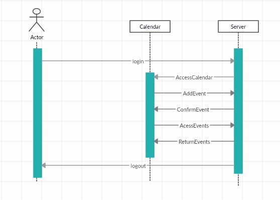

# Monthly Planner
## San Jose State University 
## CMPE 172/ Spring 2020 
## Team-Nicholas Castro and Justin Magadia 
## Sample Demo Screenshots 
##### Login Page

##### Calendar Page

##### Select Month

##### Add Event

##### See Events

## Setup Pre-requisites
This project only runs locally so these are the pre-requisites to do so. 
You will need to have NodeJS installed on the system. 
Once this is done locate the directory in which the project is stored. 
From within this directory run command prompt and type the command "npm start". 
This will allow you to view our app in (http://localhost:3000) and view it in the browser. 

## Class and Sequence Diagrams
 

 

